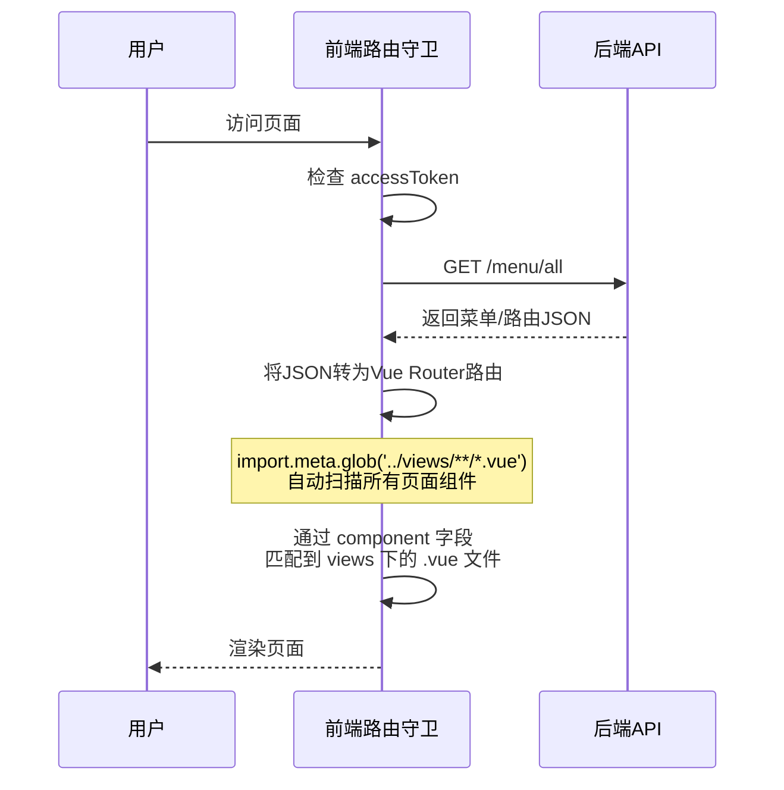
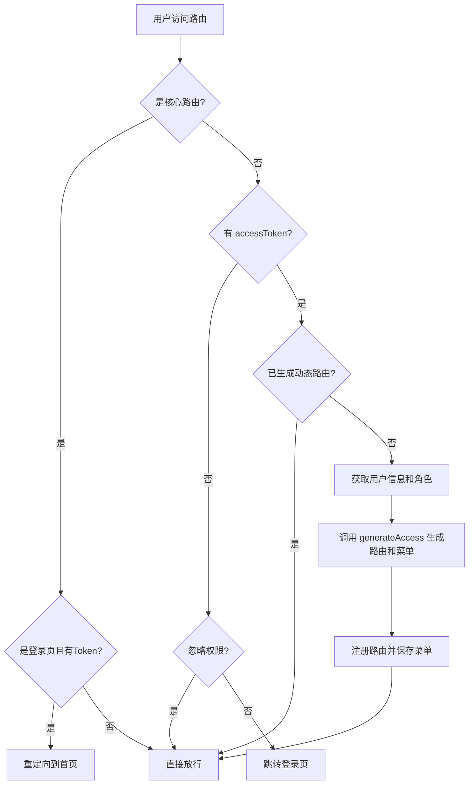

# 前端页面开发方式深度分析

本项目基于 **Vben Admin** 框架，使用 **Vue 3 + TypeScript + Ant Design Vue** 技术栈，采用 pnpm monorepo 架构。以下是页面开发的完整流程和核心模式。

---

## 1. 项目架构概览

```mermaid
graph TD
    A[apps/web-antd] --> B[src/views - 页面组件]
    A --> C[src/router - 路由系统]
    A --> D[src/api - API请求层]
    A --> E[src/store - 状态管理]
    A --> F[src/layouts - 布局组件]
    A --> G[src/adapter - 组件适配器]
    A --> H[src/locales - 国际化]
    
    I[packages/@core] --> J[共享组件/工具/类型]
    K[packages/effects] --> L[公共UI/请求/布局/hooks]
```

---

## 2. 页面开发核心三步骤

### 第一步：创建视图组件（View）

视图组件放在 `src/views/` 目录下，按**功能模块**分文件夹组织：

```
src/views/
├── _core/          # 核心页面（登录、404等，不可修改）
├── dashboard/      # 仪表盘模块
│   ├── analytics/  # 数据分析页
│   └── workspace/  # 工作台页
├── system/         # 系统管理模块
│   ├── dept/       # 部门管理
│   ├── menu/       # 菜单管理
│   ├── role/       # 角色管理
│   └── user/       # 用户管理
└── ...
```

每个页面是一个 `index.vue` 文件，使用 `<script lang="ts" setup>` 语法：

```vue
<script lang="ts" setup>
import { Page } from '@vben/common-ui';               // 框架提供的页面容器
import { Table, Button, Space } from 'ant-design-vue'; // UI组件
import { onMounted, ref } from 'vue';
import { getUserList } from '#/api/system';             // API调用

const loading = ref(false);
const dataSource = ref([]);

const fetchData = async () => {
  loading.value = true;
  try {
    const res = await getUserList({ page: 1, pageSize: 10 });
    dataSource.value = res.records || [];
  } finally {
    loading.value = false;
  }
};

onMounted(() => fetchData());
</script>

<template>
  <Page title="页面标题">
    <!-- 页面内容 -->
    <Table :dataSource="dataSource" :loading="loading" />
  </Page>
</template>
```

> [!IMPORTANT]
> - `#/` 是路径别名，指向 `src/` 目录
> - 使用 `Page` 组件（来自 `@vben/common-ui`）作为页面最外层容器
> - UI组件来自 `ant-design-vue`

---

### 第二步：创建 API 接口

API 文件放在 `src/api/` 目录下，按功能模块分文件夹：

```
src/api/
├── core/           # 核心API（认证、菜单、用户信息）
│   ├── auth.ts     # 登录/登出/刷新token
│   ├── menu.ts     # 获取菜单
│   ├── user.ts     # 获取用户信息
│   └── index.ts    # 统一导出
├── system/         # 系统管理API
│   └── index.ts    # CRUD接口
├── request.ts      # 请求客户端配置
└── index.ts        # 全局导出
```

**API 编写规范：**

```typescript
import { requestClient } from '#/api/request';

// 简单CRUD模式
export const getList = (params: any) => requestClient.get('/module/list', { params });
export const add = (data: any) => requestClient.post('/module', data);
export const update = (data: any) => requestClient.put('/module', data);
export const remove = (id: number) => requestClient.delete(`/module/${id}`);

// 带类型定义的模式（推荐）
export namespace ModuleApi {
  export interface Params { page: number; pageSize: number; }
  export interface Result { id: number; name: string; }
}
export async function getModuleList(params: ModuleApi.Params) {
  return requestClient.get<ModuleApi.Result[]>('/module/list', { params });
}
```

> [!NOTE]
> **请求客户端关键配置**（[request.ts](file:///d:/Operations/web/apps/web-antd/src/api/request.ts)）：
> - 基础URL来自环境变量 `VITE_GLOB_API_URL`（开发环境为 `/api`）
> - 自动附加 `Bearer Token` 到请求头
> - 响应拦截器约定：`{ code: 0, data: ... }` 格式，`code=0` 表示成功
> - 内置 Token 过期自动刷新和重新认证逻辑

---

### 第三步：配置路由（菜单）

本项目有**两种路由模式**：

#### 模式A：后端动态路由（当前使用 ✅）

路由和菜单数据从**后端数据库**获取，通过 `getAllMenusApi()` 接口 (`GET /menu/all`) 拉取。

工作流程：


后端返回的菜单数据格式示例：
```json
{
  "path": "/system",
  "name": "System",
  "component": "BasicLayout",
  "meta": { "title": "系统管理", "icon": "lucide:settings" },
  "children": [
    {
      "path": "/system/user",
      "name": "SystemUser",
      "component": "/system/user/index",
      "meta": { "title": "用户管理", "icon": "lucide:user" }
    }
  ]
}
```

> [!IMPORTANT]
> `component` 字段中的路径会被 `import.meta.glob('../views/**/*.vue')` 生成的 `pageMap` 匹配。例如 `"/system/user/index"` 会匹配到 `src/views/system/user/index.vue`。

#### 模式B：前端静态路由

在 `src/router/routes/modules/` 下创建 `.ts` 文件，会被 `import.meta.glob` 自动加载：

```typescript
// src/router/routes/modules/dashboard.ts
import type { RouteRecordRaw } from 'vue-router';

const routes: RouteRecordRaw[] = [
  {
    path: '/dashboard',
    name: 'Dashboard',
    meta: {
      icon: 'lucide:layout-dashboard',
      order: -1,                              // 菜单排序
      title: $t('page.dashboard.title'),      // 国际化标题
    },
    children: [
      {
        name: 'Analytics',
        path: '/analytics',
        component: () => import('#/views/dashboard/analytics/index.vue'),
        meta: {
          affixTab: true,                     // 固定标签页
          icon: 'lucide:area-chart',
          title: $t('page.dashboard.analytics'),
        },
      },
    ],
  },
];
export default routes;
```

---

## 3. 路由权限守卫流程



---

## 4. 新增页面开发清单

以新增一个"订单管理"页面为例：

| 步骤 | 操作 | 文件位置 |
|------|------|----------|
| 1 | 创建视图组件 | `src/views/order/index.vue` |
| 2 | 创建API接口 | `src/api/order/index.ts` |
| 3 | 注册导出（如需要） | 在 `src/api/index.ts` 中导出 |
| 4 | 添加路由/菜单 | **后端数据库**中插入菜单记录（当前模式） |

> [!TIP]
> 由于当前项目使用**后端动态路由**模式，新增页面时**不需要**手动创建前端路由文件。只需：
> 1. 在 `src/views/` 下创建页面组件
> 2. 在 `src/api/` 下创建API接口
> 3. 在**数据库**的菜单表中插入对应记录，`component` 字段指向视图路径

---

## 5. 关键路径别名和导入约定

| 别名 | 实际路径 | 用途 |
|------|----------|------|
| `#/` | `src/` | 应用内部模块导入 |
| `@vben/common-ui` | `packages/effects/common-ui` | 通用UI组件（Page等） |
| `@vben/request` | `packages/effects/request` | HTTP请求客户端 |
| `@vben/stores` | `packages/stores` | 全局状态管理 |
| `@vben/hooks` | `packages/effects/hooks` | 组合式API |
| `@vben/access` | `packages/effects/access` | 权限控制 |
| `@vben/layouts` | `packages/effects/layouts` | 布局组件 |
| `@vben/types` | `packages/types` | 类型定义 |
| `@vben/utils` | `packages/utils` | 工具函数 |

---

## 6. 环境配置

开发环境配置文件 [.env.development](file:///d:/Operations/web/apps/web-antd/.env.development)：
- **端口**：`VITE_PORT=5666`
- **API基础路径**：`VITE_GLOB_API_URL=/api`（通过 Vite 代理转发到后端）
- **Mock服务**：`VITE_NITRO_MOCK=false`（已关闭，使用真实后端）
